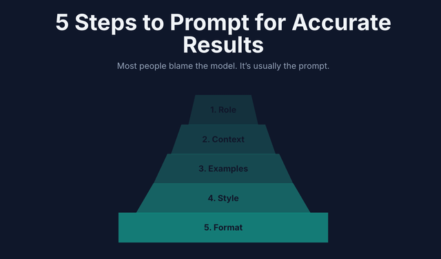

➡️ # How to Build an Effective AI Prompt for Test Case Generation (Prompt Pyramid)

Creating a clear and detailed prompt is essential for leveraging AI to generate high-quality test cases. The "Prompt Pyramid" approach helps QA professionals guide the AI by providing clear instructions, context, and expectations. This guide explains how to build a prompt using five essential layers, with practical examples and references to best practices from Academy TestRail (used only in the Request/Examples section).

<br>

<br>

---

## 1. Role
- **Who should the AI be?**
- Give the model a job, seniority, and relevant industry.
- *Example:* You are a Senior QA Engineer from the iGaming industry working for Betsson Group.

## 2. Context
- **What’s true around the task?**
- Supply constraints, assets, stage, and "why".
- *Example:* You will create a test case to test the new endpoint implemented for the Free spins sportsbook promotion.

## 3. Request/Examples
- **What “good” looks like.**
- Show patterns to copy. One example beats 1,000 adjectives.
- *Example:* Use the Academy TestRail technique to structure the test case:
  - Title: [Descriptive name of the test case]
  - Precondition: [State or data required before execution]
  - Steps: [List up to 5 clear steps]
  - Expected Results: [List up to 5 expected outcomes, one for each step]

## 4. Style
- **How it should sound.**
- Tone, reading level, do/don’t language.
- *Example:* Make it formal and professional, but add some emoji to the topics.

## 5. Format
- **Shape, length, fields, acceptance tests.**
- Tell it exactly what to deliver and how you’ll judge it.
- *Example:* Max 5 steps for the test case, and also 5 expected results for each step. Use Markdown for formatting.

---

## Example Basic Prompt Structure and AI Response

```
Role: You are a Senior QA Engineer from the iGaming industry working for Betsson Group.
Context: You will create a test case to test the new endpoint implemented for the Free spins sportsbook promotion.
Request/Examples: Use the Academy TestRail technique. Title, Precondition, up to 5 Steps, and up to 5 Expected Results.
Style: Make it formal and professional, but add some emoji to the topics.
Format: Max 5 steps, 5 expected results, use Markdown formatting.
```


---
> ## 🎯 Test Case: Verify Free Spins Sportsbook Promotion Endpoint Returns Valid Response
>
> | **Section** | **Details** |
> |--------------|-------------|
> | **🧩 Precondition** | - The Free Spins promotion is configured and active in the Sportsbook system.<br>- The API endpoint `/api/v1/promotions/free-spins` is deployed and accessible in the testing environment.<br>- The tester has valid authentication credentials (API key or JWT token).<br>- A test user with eligible criteria for the promotion exists in the database. |
> | **🧪 Test Steps** | 1. Send a `GET` request to `/api/v1/promotions/free-spins` with valid authentication headers.<br>2. Verify the HTTP response status code.<br>3. Validate the JSON response structure against the API schema (fields such as `promotionId`, `userId`, `freeSpinsCount`, `expiryDate`).<br>4. Check that the `freeSpinsCount` value matches the configured amount in the promotion settings.<br>5. Repeat the request using an ineligible user and observe the response. |
> | **✅ Expected Results** | 1. The API successfully processes the request and returns a **200 OK** status.<br>2. The response payload follows the defined JSON schema without missing or extra fields.<br>3. The `promotionId` and `userId` correspond to valid and existing records in the system.<br>4. The `freeSpinsCount` value correctly reflects the promotion configuration (e.g., `10` free spins).<br>5. When the request is made with an ineligible user, the API returns a **403 Forbidden** or a clear validation error message (`"User not eligible for promotion"`). |
---

<br><br>

# Academy TestRail Method for Request/Examples

| Topic                              | Description                                                                                  | Example                                                      |
| ----------------------------------- | -------------------------------------------------------------------------------------------- | ------------------------------------------------------------ |
| Basic Feature Scope                 | Describe the feature or functionality to be tested. Be specific about what to cover.         | Login page for a web application.                            |
| Test Environment                    | Specify the environment where the test will run. Include platform, app, device, server, etc. | Test on Chrome browser, Windows 10, staging server.          |
| Core Functionalities & Interactions  | List main actions and expected user interactions. Include workflows, fields, buttons, etc.   | User enters username and password, clicks 'Login', feedback. |
| Acceptance Criteria & Edge Cases     | Define what constitutes a successful test. Include rules, validation, and edge cases.        | Login succeeds with valid credentials, fails with invalid.   |
| Data Dependencies & Integrations     | Mention required data, external systems, or integrations. Specify data, DB, API, etc.        | User must exist in DB; login API integrates with auth. svc.  |

---

## Examples


### Example 1: Front-End Login Page Test Case Prompt
```Feature Scope:
	- Test the login page of the "MyApp" web application, including all input fields, buttons, and error messages.
Test Environment:
	- Chrome browser (latest version), Windows 10, staging server (URL: https://staging.myapp.com/login).
Core Functionalities & User Interactions:
	- User enters username and password.
	- User clicks the 'Login' button.
	- System displays loading indicator during authentication.
	- User can use 'Forgot Password' link.
	- User can toggle password visibility.
Acceptance Criteria & Edge Cases:
	- Login succeeds with valid credentials and redirects to dashboard.
	- Login fails with invalid credentials and displays error message.
	- Empty username or password fields trigger validation errors.
	- Locked or disabled accounts show specific error messages.
	- Multiple failed attempts trigger account lockout warning.
	- Special characters and long input values are handled gracefully.
	- Accessibility: All elements are reachable via keyboard navigation.
Data Dependencies & System Integrations:
	- Test users must exist in the staging database with various account states (active, locked, disabled).
	- Login API integrates with authentication and logging services.
	- Email service integration for 'Forgot Password' flow.
	- Audit logs generated for each login attempt.
```

### Example 2: Back-End Internal API New Endpoint Test Case Prompt
```Feature Scope:
	- Test the new POST /api/v2/users endpoint for creating user records in the internal HR system.
Test Environment:
	- REST API, staging server (api.staging.hr-internal.com), tested via Postman and automated scripts.
Core Functionalities & User Interactions:
	- API receives POST requests with JSON payload containing user details (name, email, role, department).
	- Validates required fields and data formats.
	- Creates new user record in the database.
	- Returns success response with user ID and details.
	- Handles authentication via internal token.
Acceptance Criteria & Edge Cases:
	- Success: Valid payload creates user and returns 201 status with user data.
	- Error: Missing or invalid fields return 400 with detailed error messages.
	- Duplicate email returns 409 conflict error.
	- Unauthorized requests return 401 error.
	- Large payloads and special characters are handled without crashing.
	- System logs all requests and responses for audit.
	- Integration: New user triggers notification to HR system and updates reporting dashboard.
Data Dependencies & System Integrations:
	- Requires connection to staging user database.
	- Integrates with authentication, notification, and reporting services.
	- Test data includes users with various roles and departments.
	- Simulate network failures and retry logic.
```

---

## Reference
- Request/Examples section inspired by [Academy TestRail](https://academy.testrail.com/)
