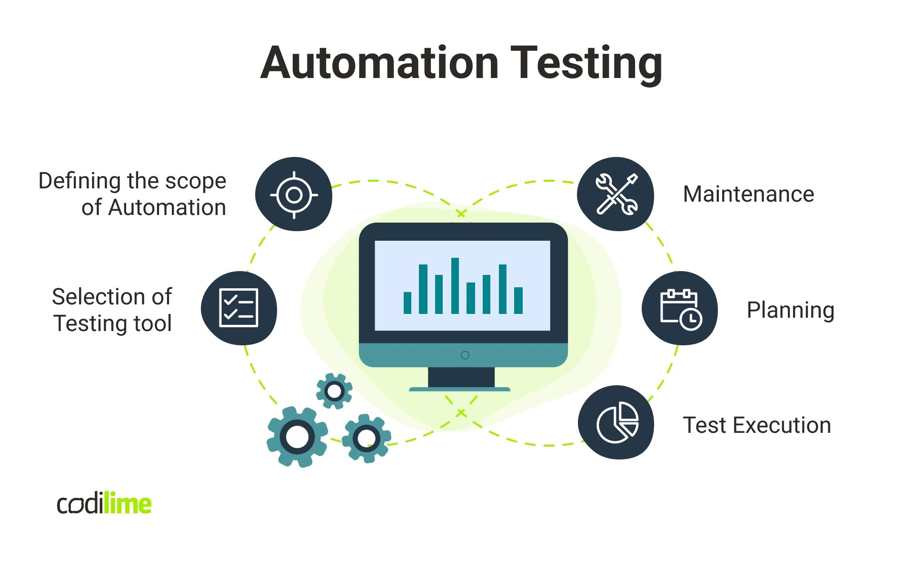

# The Importance of Test Automation and How to Decide What to Automate

## Summary

- [Why Automate Tests?](#why-automate-tests)
- [Deciding Whether to Automate a Test](#deciding-whether-to-automate-a-test)
- [Real Examples: When and What to Automate](#real-examples-when-and-what-to-automate)
  - [Frontend (FE) Test Automation](#frontend-fe-test-automation)
  - [Backend (BE) Test Automation](#backend-be-test-automation)
- [Advanced Automation Topics](#advanced-automation-topics)
  - [CI/CD Integration — pipelines, GitHub Actions, Jenkins](#cicd-integration--pipelines-github-actions-jenkins)
  - [Choosing the Right Web Automation Tool: Cypress vs Selenium vs Playwright](#choosing-the-right-web-automation-tool-cypress-vs-selenium-vs-playwright)
  - [Mobile Test Automation — Appium and alternatives](#mobile-test-automation--appium-and-alternatives)
- [Quick Comparison Table](#quick-comparison-table)
- [References](#references)


<br>

<br>
<a id="codilime-qa-automation"></a>
<a href="https://codilime.com/blog/qa-automation-what-is-it-and-why-do-you-need-it/" target="_blank" rel="noopener noreferrer">Codilime — QA Automation: What is it and why do you need it?</a>

---

## Why Automate Tests?

Test automation is a cornerstone of modern software development and QA. Its benefits include:

- **Speed:** Automated tests can run much faster than manual tests, enabling more frequent releases.
- **Repeatability:** Tests can be run consistently on every build, reducing human error.
- **Scalability:** Automation allows wide coverage, running many tests in parallel and across environments.
- **Early Bug Detection:** Automated tests can be integrated into CI/CD pipelines, catching regressions before they reach production.
- **Documentation:** Automated tests serve as living documentation for your system.

However, not every test should be automated. Automation has costs—maintenance, infrastructure, and complexity—which must be balanced against the benefits.

## Deciding Whether to Automate a Test

The [`decideAutomate`](https://github.com/brunoengineer/decideAutomate) tool (a React application for QAs) helps guide this decision. It uses a questionnaire that considers factors such as:

- **Test Frequency:** Is the test run on every build, sprint, or only for one release?
- **Test Type:** Is it a regression, smoke, or exploratory test?
- **Priority:** Is the functionality critical to your application?
- **Tech Stack Compatibility:** Can you automate it with your current tools?
- **Data Variability:** Does it need to run with multiple datasets?
- **Test Duration:** Is it quick (unit), moderate (integration), or long (E2E)?
- **UI/UX Focus:** Does it check usability or layout details?
- **Code Stability:** Is the tested area prone to frequent changes?
- **Complexity and Maintenance:** Do you have resources and a plan to maintain automated tests?
- **Integration Needs:** Does the test require other systems or environments?
- **Architecture Requirements:** Is automation setup simple or does it need extensive infrastructure?

The tool provides recommendations:
- **Automate it:** Benefits outweigh costs.
- **Automate if you have free time:** Useful, but not urgent.
- **You probably shouldn’t automate:** Manual may suffice.
- **Do not automate:** Costs outweigh benefits.

## Real Examples: When and What to Automate

### Frontend (FE) Test Automation

**Good Candidates:**
- **Smoke/Regression Tests:** E.g., "Login workflow works on all browsers." This is repeatable, critical, and time-consuming if done manually.
- **Input Validation:** E.g., "Submitting empty forms displays error messages." Can be reliably checked via automation.
- **Navigation Flows:** E.g., "User can reach checkout from the product page." Ensures critical flows are unbroken.

**Poor Candidates:**
- **Visual/Usability Checks:** E.g., "Button color matches design spec." These are fragile and prone to false positives due to minor UI changes.
- **Random Negative Testing:** E.g., "Try random clicks everywhere." Better suited for exploratory/manual testing.

**Example Automated FE Test (using Playwright):**
```typescript
test('homepage displays correct title', async ({ page }) => {
  await page.goto('http://localhost:5173/decideAutomate/');
  await expect(page.locator('h1')).toHaveText('Test Automation Assessment');
});
```

### Backend (BE) Test Automation

**Good Candidates:**
- **API Contract/Regression Tests:** E.g., "GET /users returns correct schema and status codes." These can be run on every build and catch breaking changes.
- **Business Logic Validation:** E.g., "Discounts are applied correctly for premium users." Logic rarely changes and must be correct.

**Poor Candidates:**
- **Tests Requiring Complex/Unstable Integration:** E.g., "Integration with an external partner API that is only available in production." These are hard to automate, brittle, and may have side effects.
- **Rarely Used One-off Data Migrations:** Automating these may waste resources if only run once.

**Example Automated BE Test (conceptual):**
```javascript
// Using a tool like Jest or Mocha
it('should return 200 for authenticated GET /users', async () => {
  const res = await api.get('/users').set('Authorization', 'Bearer token');
  expect(res.status).toBe(200);
  expect(res.body).toMatchObject({ users: expect.any(Array) });
});
```

---

## Advanced Automation Topics

### CI/CD Integration — pipelines, GitHub Actions, Jenkins
- Integrate automated tests into your CI/CD pipeline so tests run automatically on commits, PRs, nightly builds or releases. This ensures regressions are detected early and provides fast feedback to the team.
- GitHub Actions: simple to configure for GitHub repos. Use workflow files (.github/workflows/*.yml) to run jobs on push/PR. Typical steps: checkout, install dependencies, run unit tests, start test environment (containers), run integration/E2E tests, and publish reports.
  - Example (simplified):
    ```yaml
    name: CI
    on: [push, pull_request]
    jobs:
      test:
        runs-on: ubuntu-latest
        steps:
          - uses: actions/checkout@v3
          - name: Setup Node
            uses: actions/setup-node@v3
            with: { node-version: '18' }
          - run: npm ci
          - run: npm run test:unit
          - run: npm run test:e2e -- --headless
          - name: Upload test results
            uses: actions/upload-artifact@v3
            with: { name: test-results, path: ./reports }
    ```
- Jenkins: more flexible for complex or self-hosted environments. Use pipeline (Jenkinsfile) to orchestrate stages, parallelization, and environment provisioning. Jenkins works well with Docker agents and can integrate with many enterprise tools.
- Best practices:
  - Fail fast: run quick unit/smoke tests before long E2E jobs.
  - Parallelize where possible to reduce feedback time.
  - Publish and archive test reports, screenshots, and artifacts for debugging.
  - Protect CI secrets (tokens) with vaults or built-in secrets management.

### Choosing the Right Web Automation Tool: Cypress vs Selenium vs Playwright
- Selenium (WebDriver): The long-standing, language-agnostic standard. Pros: broad browser support, mature ecosystem, multiple bindings (Java, Python, JS). Cons: can be slower, more boilerplate, and setup complexity for modern apps.
- Cypress: Modern JS-first testing tool focused on developer experience. Pros: fast, great DX, time-travel debugging, built-in retryability; Cons: runs in-browser (originally Chrome-family), limited multi-tab support, historically limited cross-browser (improving), primarily JavaScript.
- Playwright: Newer, multi-language (JS/TS, Python, .NET, Java) framework with first-class cross-browser support (Chromium, WebKit, Firefox). Pros: fast, supports multiple browsers including WebKit (Safari), supports multiple contexts, reliable selectors and auto-waiting. Cons: still younger than Selenium but rapidly maturing.
- Decision tips:
  - If you need broad language support and enterprise integrations, Selenium remains a safe choice.
  - For JavaScript/TypeScript projects with modern apps, consider Playwright for cross-browser needs or Cypress for fast DX and test writing.
  - Evaluate flakiness, debugging features, and community support when choosing.

### Mobile Test Automation — Appium and alternatives
- Appium: an open-source cross-platform tool that drives native, hybrid, and mobile web apps using the WebDriver protocol. Pros: supports iOS and Android, many language bindings, reuses Selenium/WebDriver knowledge. Cons: can be slower to setup, device farm management required, and occasional flakiness with real devices.
- Alternatives: Espresso (Android, Java/Kotlin), XCUITest (iOS, Swift/Obj-C) — these are platform-specific but provide faster and more stable tests for deep native automation when you can write tests in the platform language.
- Cloud device farms: BrowserStack, Sauce Labs, Firebase Test Lab can simplify device coverage without managing physical devices.
- Best practices for mobile automation:
  - Keep E2E mobile tests focused on critical flows (login, purchase, onboarding) and short to reduce flakiness.
  - Use simulators/emulators for quick feedback and a small real-device matrix for acceptance.
  - Automate provisioning of test data and app state to reduce manual setup.

---

### Quick Comparison Table

| Area | Recommended for | Notes |
|------|-----------------|-------|
| CI/CD | GitHub Actions (cloud), Jenkins (self-hosted) | GitHub Actions is simpler for GitHub repos; Jenkins is powerful for complex pipelines and on-premise needs |
| Web automation | Playwright / Cypress / Selenium | Playwright for cross-browser modern apps; Cypress for fast DX; Selenium for language-agnostic enterprise needs |
| Mobile automation | Appium (cross-platform), Espresso/XCUITest (native) | Use Appium for cross-platform and device farms; native frameworks are more stable for platform-specific suites |


## References

- [Martin Fowler: The Practical Test Pyramid](https://martinfowler.com/articles/practical-test-pyramid.html#TheImportanceOftestAutomation)
- [TestRail Blog: How to Automate Test Cases](https://www.testrail.com/blog/automate-testcase/)
- [decideAutomate GitHub Repository](https://github.com/brunoengineer/decideAutomate)

---

**Summary:**  
Automating tests is essential, but every automation must be a conscious decision. Use tools and criteria to evaluate the ROI for each test. Focus your efforts where automation brings the greatest value to your product and team.