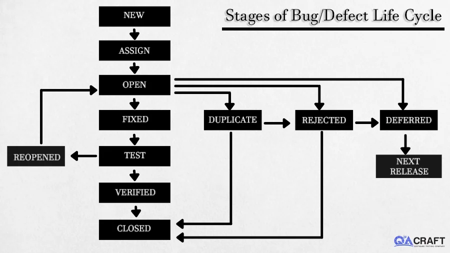

# Bug/Defect Life Cycle and Application in QA Work

The bug or defect life cycle is a critical part of software quality assurance. It provides a structured approach to identifying, reporting, fixing, and verifying issues in software development. Below is a detailed explanation of the stages of the bug life cycle and practical applications for QA daily tasks.

## Visual Representation

 

 

The diagram above illustrates the flow of the bug life cycle, highlighting various stages and transitions between them.

## Stages of Bug/Defect Life Cycle

### 1. **New**
- **Description**: A defect is discovered and reported by a tester. It is assigned the status `New`.
- **QA Action**: Document the defect in detail, including reproduction steps, screenshots, and expected versus actual results.

### 2. **Assigned**
- **Description**: The bug is reviewed and assigned to a developer for resolution.
- **QA Action**: Ensure the defect is assigned to the correct developer and provide clarifications if needed.

### 3. **Open**
- **Description**: The developer starts analyzing and working on fixing the defect.
- **QA Action**: Be available to provide additional information, such as logs or environment details.

### 4. **Fixed**
- **Description**: The developer fixes the defect and updates the status to `Fixed`.
- **QA Action**: Prepare for retesting by reviewing the fix details.

### 5. **Test**
- **Description**: The fixed defect is assigned back to the QA team for validation.
- **QA Action**: Perform regression testing and verify if the defect is resolved as expected.

### 6. **Verified**
- **Description**: If the defect is fixed and no further issues are found, its status is updated to `Verified`.
- **QA Action**: Confirm that the fix meets requirements and that no new issues are introduced.

### 7. **Closed**
- **Description**: The defect is considered resolved and closed after verification.
- **QA Action**: Mark the defect as closed in the tracking system and document any lessons learned.

### 8. **Reopened**
- **Description**: If the issue persists or reoccurs, the defect is reopened and reassigned to the developer.
- **QA Action**: Provide additional evidence of the issue to the developer and collaborate on resolution.

### Special Cases
- **Duplicate**: The defect has already been reported. It is marked as a duplicate.
- **Rejected**: The reported defect is not valid or reproducible.
- **Deferred**: The defect is valid but postponed to a later release due to priority or impact.
- **Next Release**: Defects marked as deferred are scheduled for resolution in the upcoming release.

## Applying Bug Life Cycle in QA Daily Work

### 1. **Systematic Bug Reporting**
QA engineers should ensure clear, concise, and detailed bug reports. Include:
- Steps to reproduce.
- Screenshots, logs, or videos.
- Expected and actual results.

### 2. **Communication and Collaboration**
- Communicate effectively with developers during the **Assigned** and **Open** stages.
- Provide any additional information or clarify misunderstandings promptly.

### 3. **Prioritization**
- Focus on critical and high-severity defects.
- Work with the product team to defer non-critical defects to future releases.

### 4. **Regression Testing**
- Ensure that fixes do not introduce new issues.
- Validate related functionality to maintain overall software stability.

### 5. **Documentation**
- Maintain accurate and up-to-date records of all defects throughout the life cycle.
- Use tools like JIRA, Bugzilla, or Azure DevOps for tracking.

### 6. **Continuous Improvement**
- Analyze closed defects for patterns.
- Provide feedback to improve development and testing processes.

## Conclusion
Understanding and implementing the bug life cycle effectively ensures high-quality software delivery. By following the structured approach outlined in this document, QA engineers can enhance their daily workflows and contribute significantly to the success of software projects.
