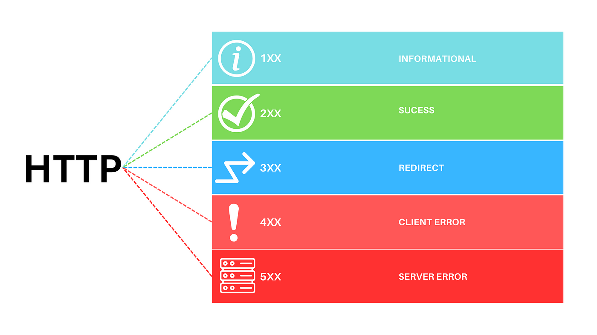

# HTTP Error Codes Explained

# 📑 Table of Contents

- [HTTP Error Codes Explained](#http-error-codes-explained)

  - [Overview](#overview)

- [📘 Importance of REST API Response Codes for QA Engineers](#-importance-of-rest-api-response-codes-for-qa-engineers)

  - [✅ 1. Ensures Accurate Test Validation](#-1-ensures-accurate-test-validation)
  - [🐞 2. Helps Distinguish Frontend vs Backend Issues](#-2-helps-distinguish-frontend-vs-backend-issues)
  - [🔐 3. Validates Authentication and Authorization Flows](#-3-validates-authentication-and-authorization-flows)
  - [🧪 4. Confirms Correct HTTP Method Usage](#-4-confirms-correct-http-method-usage)
  - [🛠️ 5. Enables Detailed and Actionable Bug Reports](#️-5-enables-detailed-and-actionable-bug-reports)
  - [🔁 6. Facilitates Testing of Error Handling and Retry Logic](#-6-facilitates-testing-of-error-handling-and-retry-logic)
  - [📊 Summary Table of Common Status Codes](#-summary-table-of-common-status-codes)

- [🧪 REST API Response Codes – Why QA Must Know and Test Them](#-rest-api-response-codes--why-qa-must-know-and-test-them)

  - [🚀 Why Response Codes Matter](#-why-response-codes-matter)
  - [🔍 What to Test as a QA Engineer](#-what-to-test-as-a-qa-engineer)
    - [✅ Positive Tests](#-positive-tests-happy-path)
    - [🧨 Negative Tests](#-negative-tests-unhappy-path)
    - [🔒 Security Tests](#-security-tests)
    - [🔁 Retry & Rate Limiting Tests](#-retry--rate-limiting-tests)
    - [🔧 Error Simulation Tests](#-error-simulation-tests)
  - [🧪 Types of Tests You Can Run](#-types-of-tests-you-can-run)
  - [🚫 Common Mistakes Developers Make](#-common-mistakes-developers-make)
  - [✅ Best Practices for Developers (And What QA Should Validate)](#-best-practices-for-developers-and-what-qa-should-validate)
  - [🧠 Why Good Status Codes = Good API Design](#-why-good-status-codes--good-api-design)
  - [📘 Example: Testing `POST /users`](#-example-testing-post-users)
  - [✅ Summary](#-summary)
  - [🧠 Conclusion](#-conclusion)

- [HTTP Error Codes - Complete List](#http-error-codes---complete-list)
  - [1xx: Informational](#1xx-informational)
  - [2xx: Success](#2xx-success)
  - [3xx: Redirection](#3xx-redirection)
  - [4xx: Client Errors](#4xx-client-errors)
  - [5xx: Server Errors](#5xx-server-errors)

---

## Overview

HTTP (Hypertext Transfer Protocol) response status codes indicate whether a specific HTTP request has been successfully completed. Responses are grouped into five classes:

<br>

<br>

- **1xx (Informational)** – Request received, continuing process.
- **2xx (Success)** – Request was successfully received, understood, and accepted.
- **3xx (Redirection)** – Further action needs to be taken in order to complete the request.
- **4xx (Client Errors)** – The request contains bad syntax or cannot be fulfilled.
- **5xx (Server Errors)** – The server failed to fulfill a valid request.

---

# 📘 Importance of REST API Response Codes for QA Engineers

Understanding HTTP response codes is essential for QA engineers to ensure APIs function correctly, report bugs effectively, and validate all edge cases.

---

## ✅ 1. Ensures Accurate Test Validation

- HTTP status codes confirm whether an API behaves as expected.
- Example:
  ```http
  POST /users
  Response: 201 Created
  ```
- A `201 Created` confirms successful resource creation.

---

## 🐞 2. Helps Distinguish Frontend vs Backend Issues

- Identifying the source of the issue is easier with status codes.
- Example:
  ```http
  GET /orders/999
  Response: 404 Not Found
  ```
- Could be:
  - A valid test case for a non-existent order.
  - Or a bug where frontend sends the wrong order ID.

---

## 🔐 3. Validates Authentication and Authorization Flows

- Differentiating between auth issues is critical.
- Common codes:
  - `401 Unauthorized` → User is not authenticated
  - `403 Forbidden` → User is authenticated but not allowed
- Example:
  ```http
  DELETE /admin/users/42
  Response: 403 Forbidden
  ```

---

## 🧪 4. Confirms Correct HTTP Method Usage

- Ensures that APIs reject invalid HTTP methods.
- Example:
  ```http
  DELETE /products/123
  Response: 405 Method Not Allowed
  ```

---

## 🛠️ 5. Enables Detailed and Actionable Bug Reports

- QA can report issues with specific and reproducible info:
  > ❌ Instead of: “API doesn’t work”  
  > ✅ Use: “`500 Internal Server Error` when sending invalid JSON to `/checkout`”

---

## 🔁 6. Facilitates Testing of Error Handling and Retry Logic

- Helps QA simulate network errors and system failures.
- Example:
  ```http
  GET /payments
  Response: 503 Service Unavailable
  Retry-After: 120
  ```
- Allows testing of backoff and retry strategies.

---

## 📊 Summary Table of Common Status Codes

| Code | Meaning               | When to Expect It                |
| ---- | --------------------- | -------------------------------- |
| 200  | OK                    | Successful GET or PUT request    |
| 201  | Created               | Resource successfully created    |
| 400  | Bad Request           | Malformed request data           |
| 401  | Unauthorized          | Missing/invalid auth credentials |
| 403  | Forbidden             | No permission to access          |
| 404  | Not Found             | Resource does not exist          |
| 405  | Method Not Allowed    | Wrong HTTP verb used             |
| 500  | Internal Server Error | Backend exception or crash       |
| 503  | Service Unavailable   | Temporary server failure         |

# 🧪 REST API Response Codes – Why QA Must Know and Test Them

QA engineers play a vital role in ensuring APIs behave correctly under all conditions. A solid understanding of HTTP response codes is critical not just for _validating_ APIs, but also for _encouraging better development practices_.

---

## 🚀 Why Response Codes Matter

- ✅ **Clarity**: They indicate exactly what happened (success, error, permission issue, etc.).
- 📊 **Consistency**: Aids frontend integration and API consumers.
- 🧩 **Debugging**: Easier to troubleshoot if responses are meaningful and standardized.
- 🛡️ **Security**: Reveals or hides the right information to clients.
- 🤝 **Dev/QE Collaboration**: Enables better bug reports and conversations.

---

## 🔍 What to Test as a QA Engineer

### ✅ 1. **Positive Tests** (Happy Path)

- Ensure the API returns expected **2xx codes** when used correctly.

  Example:

  ```http
  GET /users/10
  Response: 200 OK
  ```

### 🧨 2. **Negative Tests** (Unhappy Path)

- Use invalid inputs or methods to validate proper 4xx/5xx responses.

  Examples:

  ```http
  GET /users/999999
  Response: 404 Not Found

  POST /users with invalid JSON
  Response: 400 Bad Request
  ```

### 🔒 3. **Security Tests**

- Verify **unauthorized and forbidden** access is handled safely.
  ```http
  GET /admin/reports
  Response: 401 Unauthorized (if no token)
  Response: 403 Forbidden (if token is valid but lacks role)
  ```

### 🔁 4. **Retry & Rate Limiting Tests**

- Simulate API load, retry conditions, and quotas.
  ```http
  GET /inventory
  Response: 429 Too Many Requests
  Retry-After: 60
  ```

### 🔧 5. **Error Simulation Tests**

- Trigger backend failures or network issues to ensure proper `5xx` codes:
  - `500 Internal Server Error`
  - `502 Bad Gateway`
  - `503 Service Unavailable`

---

## 🧪 Types of Tests You Can Run

| Test Type        | Focus                                                  |
| ---------------- | ------------------------------------------------------ |
| Unit Tests       | Controller returns correct status code for logic paths |
| API Integration  | Full request/response validation                       |
| Load & Stress    | Stability of response codes under pressure             |
| Security         | Authorization/Authentication response accuracy         |
| Negative Testing | Malformed inputs, invalid methods, broken contracts    |
| Contract Testing | Status codes and payload match API spec (e.g. OpenAPI) |

---

## 🚫 Common Mistakes Developers Make

| Mistake                             | Why It's a Problem                       |
| ----------------------------------- | ---------------------------------------- |
| Returning `200 OK` on error         | Misleads clients into thinking it worked |
| Using `500` for everything          | Hides root cause, poor observability     |
| Ignoring `401` vs `403` distinction | Breaks security testing and UX logic     |
| Wrong `404` usage                   | Reveals too much or too little info      |
| Missing `405` handling              | Incomplete REST design                   |

---

## ✅ Best Practices for Developers (And What QA Should Validate)

- Use **specific** status codes (`201`, `204`, `422`, etc.).
- Make sure **error payloads** are consistent:
  ```json
  {
    "error": "Invalid input",
    "code": 400,
    "details": ["email is required"]
  }
  ```
- Follow standards like **RFC 9110** or API design guides (e.g., Stripe, GitHub).
- Implement fallback handling for unexpected errors:
  ```http
  Response: 500 Internal Server Error
  Body: { "error": "Unexpected server error. Please try again." }
  ```

---

## 🧠 Why Good Status Codes = Good API Design

- 📱 **Frontend Friendly**: Easier for frontend to display the right message.
- 🔄 **Reliable Integrations**: Clients know how to react.
- 🐞 **Faster Debugging**: Developers and QA see the root problem instantly.
- 📊 **Monitoring & Analytics**: Tools like New Relic, Datadog, or Sentry can filter issues by status code.

---

## 📘 Example: Testing `POST /users`

| Scenario                      | Expected Status Code        | QA Test Case Description                                |
| ----------------------------- | --------------------------- | ------------------------------------------------------- |
| Valid data                    | `201 Created`               | Confirm user is created and location header is returned |
| Missing email                 | `400 Bad Request`           | Should return validation error for missing field        |
| Email already exists          | `409 Conflict`              | Should prevent duplicate user creation                  |
| Unauthorized attempt          | `401 Unauthorized`          | Missing token should fail                               |
| No permission to create user  | `403 Forbidden`             | Token has insufficient scope                            |
| Internal DB error (simulated) | `500 Internal Server Error` | Should gracefully return generic error                  |

---

## ✅ Summary

QA engineers must **understand**, **test**, and **challenge** API response codes to:

- Build robust test coverage
- Catch poor API design early
- Ensure reliability and usability
- Enable scalable integration

Status codes are not just numbers — they are signals of application health, correctness, and design integrity.

```json
// As QA, always ask:
{
  "Does this response code truly reflect what happened?"
}
```

---

## 🧠 Conclusion

For effective API testing, QA engineers must interpret and validate REST API response codes. This understanding leads to:

- Precise test coverage
- Better debugging
- Clear communication with developers

---

# HTTP Error Codes - Complete List

## 1xx: Informational

These codes indicate that the request was received and understood, and the process is continuing.

- **100 Continue** – The server has received the request headers and the client should proceed to send the request body.
- **101 Switching Protocols** – The requester has asked the server to switch protocols.
- **102 Processing** – The server has received and is processing the request, but no response is available yet.
- **103 Early Hints** – The server is likely to send a final response with the header values included in the informational response.

---

## 2xx: Success

The request was successfully received, understood, and accepted.

- **200 OK** – Standard response for successful HTTP requests.
- **201 Created** – The request was successful and a new resource was created.
- **202 Accepted** – The request has been accepted for processing, but the processing is not complete.
- **203 Non-Authoritative Information** – The server successfully processed the request, but is returning information from another source.
- **204 No Content** – The server successfully processed the request but is not returning any content.
- **205 Reset Content** – The server successfully processed the request but asks the client to reset the document view.
- **206 Partial Content** – The server is delivering only part of the resource due to a range header sent by the client.

---

## 3xx: Redirection

Further action needs to be taken by the client in order to complete the request.

- **300 Multiple Choices** – There are multiple options for the requested resource.
- **301 Moved Permanently** – The resource has been permanently moved to a new URL.
- **302 Found** – The resource is temporarily located at a different URL.
- **303 See Other** – The response can be found at another URL using GET.
- **304 Not Modified** – The resource has not been modified since the last request.
- **307 Temporary Redirect** – Similar to 302 but forbids changing the HTTP method.
- **308 Permanent Redirect** – Similar to 301 but forbids changing the HTTP method.

---

## 4xx: Client Errors

These errors indicate that the request contains incorrect syntax or cannot be fulfilled.

- **400 Bad Request** – The server cannot process the request due to client error.
- **401 Unauthorized** – Authentication is required.
- **402 Payment Required** – Reserved for future use.
- **403 Forbidden** – The request is legal, but the server refuses to fulfill it.
- **404 Not Found** – The requested resource could not be found.
- **405 Method Not Allowed** – The request method is not allowed for the resource.
- **406 Not Acceptable** – The server cannot produce a response matching the Accept header.
- **407 Proxy Authentication Required** – Authentication with a proxy is required.
- **408 Request Timeout** – The client took too long to send the request.
- **409 Conflict** – The request conflicts with the current state of the resource.
- **410 Gone** – The resource is no longer available.
- **411 Length Required** – The request does not specify Content-Length.
- **412 Precondition Failed** – A precondition specified in the request headers was not met.
- **413 Payload Too Large** – The request entity is larger than allowed.
- **414 URI Too Long** – The request URI is longer than the server can process.
- **415 Unsupported Media Type** – The request format is not supported.
- **416 Range Not Satisfiable** – The range specified in the request header cannot be fulfilled.
- **417 Expectation Failed** – The server cannot meet the Expect request-header field requirements.
- **418 I'm a Teapot** – Easter egg from the HTCPCP/1.0 protocol.
- **429 Too Many Requests** – The client has sent too many requests in a given amount of time.

---

## 5xx: Server Errors

These errors indicate that the server has failed to fulfill a valid request.

- **500 Internal Server Error** – A generic error message for server failure.
- **501 Not Implemented** – The server does not support the requested functionality.
- **502 Bad Gateway** – The server received an invalid response from an upstream server.
- **503 Service Unavailable** – The server is overloaded or under maintenance.
- **504 Gateway Timeout** – The upstream server did not respond in time.
- **505 HTTP Version Not Supported** – The server does not support the requested HTTP version.
- **507 Insufficient Storage** – The server does not have enough space to store the resource.
- **508 Loop Detected** – The server detected an infinite loop while processing the request.

---
