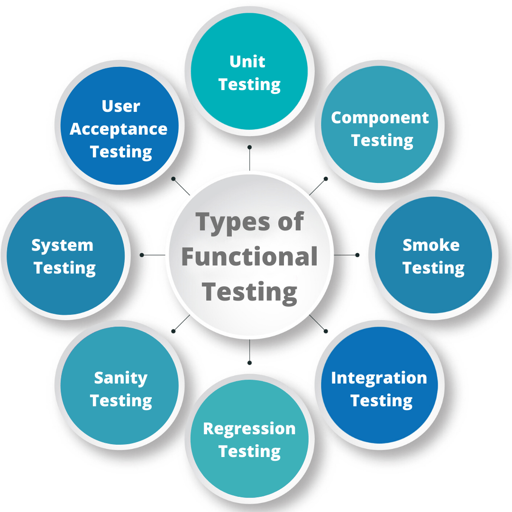
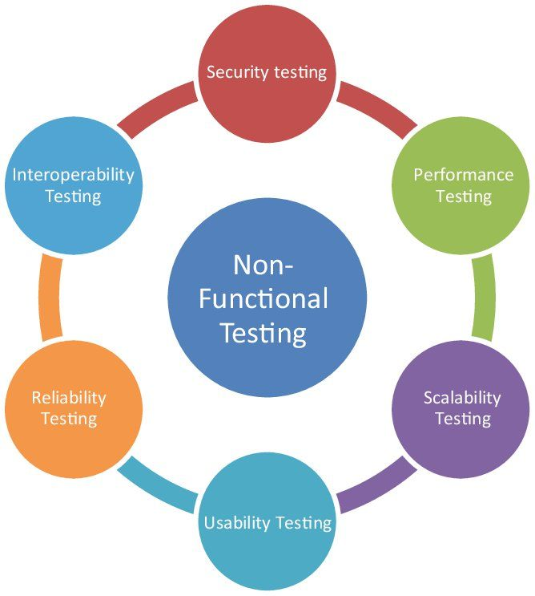
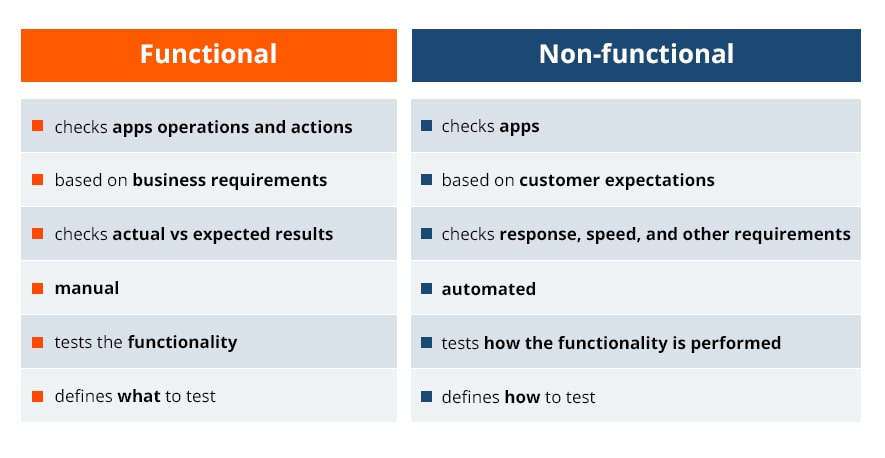

# Functional vs Non-Functional Testing in QA Engineering

## 1. Functional Testing
Functional testing ensures that the web application works according to specified requirements. It validates what the system **should do**.

 

 

### **Examples of Functional Testing:**
- **Unit Testing** – Testing individual functions or components in isolation.
- **Integration Testing** – Ensuring different modules or services work together.
- **System Testing** – Evaluating the entire application against requirements.
- **Regression Testing** – Verifying that recent code changes do not break existing functionality.
- **User Acceptance Testing (UAT)** – Checking if the application meets business and user needs.
- **Smoke Testing** – A quick check of major functionalities to ensure stability.

### **Common Functional Test Cases:**
- ✅ Verify that users can successfully register and log in.
- ✅ Ensure that password reset functionality works correctly.
- ✅ Validate that users can add, edit, and delete items in a shopping cart.
- ✅ Check that form validation messages appear when incorrect inputs are entered.
- ✅ Confirm that search results display the correct data.

---

## 2. Non-Functional Testing
Non-functional testing evaluates how well the system performs rather than its core functionality. It ensures aspects like usability, performance, security, and scalability.

 

 

### **Examples of Non-Functional Testing:**
- **Performance Testing** – Assessing response times and speed under normal and peak conditions.
- **Load Testing** – Checking system behavior under high traffic loads.
- **Stress Testing** – Pushing the system to its limits to identify breaking points.
- **Security Testing** – Detecting vulnerabilities like SQL injection or XSS attacks.
- **Usability Testing** – Ensuring a user-friendly interface and smooth navigation.
- **Compatibility Testing** – Checking system performance across different browsers and devices.

### **Common Non-Functional Test Cases:**
- ✅ Measure page load time under different network conditions.
- ✅ Verify how the application behaves with 1,000+ simultaneous users.
- ✅ Test response time when the database is under heavy queries.
- ✅ Ensure that the application follows accessibility standards (WCAG compliance).
- ✅ Scan for security vulnerabilities like weak authentication mechanisms.

---

## **Key Differences**

 

 

Both **functional** and **non-functional** testing are essential to ensure a high-quality web application. ✅🚀
