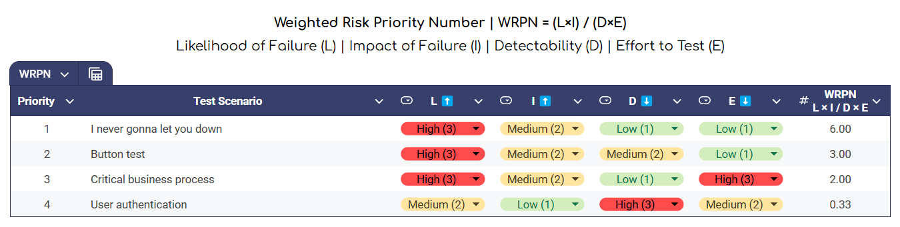

# Test Prioritization Using WRPN (Weighted Risk Priority Number)

## Overview
The WRPN method is a framework used by QA Engineers to prioritize test scenarios based on the risks they pose. It calculates the priority of tests by assessing four key factors:

1. **Likelihood of Failure (L)**
2. **Impact of Failure (I)**
3. **Detectability (D)**
4. **Effort to Test (E)**

The formula for WRPN is:

**WRPN = (L × I) / (D × E)**

Higher WRPN values indicate higher priority tests.

---

## Steps in the Prioritization Process

### 1. **Define the Test Scenarios**
List all test scenarios that need to be evaluated. For example:
- User authentication
- Critical business process
- Button functionality

### 2. **Evaluate Each Factor**
Assign a rating for each of the following:
- **Likelihood of Failure (L):** How likely is the functionality to fail? (e.g., High = 3, Medium = 2, Low = 1)
- **Impact of Failure (I):** How severe is the failure’s impact? (e.g., High = 3, Medium = 2, Low = 1)
- **Detectability (D):** How easily can the failure be detected? (e.g., High = 3, Medium = 2, Low = 1)
- **Effort to Test (E):** How much effort is required to test this scenario? (e.g., High = 3, Medium = 2, Low = 1)

### 3. **Calculate WRPN**
For each test scenario, apply the formula:

**WRPN = (L × I) / (D × E)**

### 4. **Prioritize Based on WRPN**
Rank the test scenarios from highest to lowest WRPN. Scenarios with a higher WRPN should be addressed first as they represent the highest risk.

---

## Example Table

 

 

---

## Benefits of Using WRPN
- **Objective Decision-Making:** Quantifies the risk associated with test scenarios.
- **Resource Optimization:** Focuses on high-risk tests, ensuring critical areas are tested first.
- **Time Management:** Reduces testing time on low-risk scenarios.

---

## Conclusion
The WRPN method provides a structured and efficient approach to test prioritization, ensuring that high-risk areas are addressed promptly. By applying this framework, QA engineers can optimize their efforts and deliver high-quality software products.
