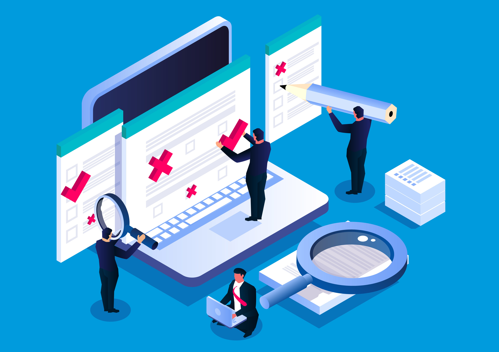

# Review Activities in Software Testing

<br>

<br>

Review activities are part of **static testing**, where defects are found without executing code. Reviews help improve quality early in the software lifecycle.

---

## Full Set of Common Review Activities

Here are the **typical stages** of a **formal review** (like an inspection), including the ones you already mentioned:

| Step | Activity Name                       | Description                                                                                               |
| ---- | ----------------------------------- | --------------------------------------------------------------------------------------------------------- |
| 1️⃣   | **Planning**                        | Identify review type, goals, participants, schedule, and entry criteria.                                  |
| 2️⃣   | **Review Initiation / Kick-off**    | Introduce the work product, explain objectives, assign roles (author, moderator, reviewers, scribe).      |
| 3️⃣   | **Individual Review (Preparation)** | Each reviewer examines the document/code alone, noting issues using checklists or guidelines.             |
| 4️⃣   | **Review Meeting / Discussion**     | Team meets to discuss defects found, clarify misunderstandings, and log issues.                           |
| 5️⃣   | **Rework**                          | Author corrects the identified defects. May be done with or without a follow-up review.                   |
| 6️⃣   | **Follow-Up**                       | Moderator verifies that all major issues were resolved and exit criteria are met.                         |
| 7️⃣   | **Analysis and Reporting**          | Collect metrics (e.g. number of defects, time spent), identify process improvements, and report outcomes. |

---

## Optional or Supporting Activities

Some additional elements might be included depending on the organization or process maturity:

- **Defect Logging**  
  Track issues formally in a defect tracker or log sheet.

- **Checklist Creation/Review**  
  Develop or tailor checklists that guide reviewers (e.g. for requirements, test cases, or code).

- **Exit Review / Approval**  
  Final check that the document/code meets quality standards and can move forward (often used in compliance-heavy domains).

---

## Example in Code Review Context

A practical example for a **code review**:

1. **Planning** → Decide to review a new module before integration
2. **Kick-off** → Dev lead explains what the module does
3. **Individual Review** → Reviewers read the code and log potential bugs
4. **Review Meeting** → Discuss potential issues (e.g., logic bugs, naming conventions)
5. **Rework** → Author fixes the code
6. **Follow-Up** → Dev lead checks that issues are resolved
7. **Reporting** → Capture how many issues were found to improve future development

---

## TL;DR – Main Activities (Full Cycle)

```
1. Planning
2. Review Initiation (Kick-off)
3. Individual Review (Preparation)
4. Review Meeting (Discussion)
5. Rework
6. Follow-Up
7. Communication, Analysis & Reporting
```

---

## Why Reviews Matter

- Catch defects **before costly rework.**
- Improve quality and clarity of documents and code.
- Encourage **collaboration and shared understanding.**

Both informal and formal reviews are crucial for delivering high-quality software!

# Roles in Reviews

Reviews are collaborative activities where different people have defined responsibilities. Here’s a broader list of common roles you might see in **formal or informal reviews** (e.g. inspections, walkthroughs, peer reviews).

---

## 📋 1. Author

**Definition:**

- The person who created the work product under review (e.g. code, requirements, test cases).

**Responsibilities:**

- Explains the content if questions arise.
- Clarifies misunderstandings.
- Implements changes if defects are found.

**Example:**

- A developer who wrote the code being reviewed.

---

## 🧑‍💼 2. Review Leader (Moderator)

**Definition:**

- Organizes and manages the review process.

**Responsibilities:**

- Plans the review meeting.
- Allocates reviewers.
- Keeps the review focused and efficient.

**Example:**

- A senior tester scheduling a review of test cases.

---

## 🤝 3. Facilitator

**Definition:**

- Ensures the review meeting runs smoothly in a **safe, respectful environment.**

**Responsibilities:**

- Manages discussion.
- Resolves conflicts.
- Encourages participation.

**Example:**

- A project lead guiding a review session to avoid blame and focus on issues.

---

## ✍️ 4. Scribe

**Definition:**

- Records the results of the review.

**Responsibilities:**

- Logs defects, decisions, and action items.
- Provides the official review summary.

**Example:**

- A team member typing notes during a requirements review.

---

## 🧐 5. Reviewer

**Definition:**

- Examines the work product to identify defects.

**Responsibilities:**

- Prepares independently before the meeting.
- Participates in discussion.
- Brings specific expertise.

**Example:**

- A security specialist reviewing code for vulnerabilities.

---

## 👨‍💼 6. Manager

**Definition:**

- Provides resources and support for the review.

**Responsibilities:**

- Decides what work products need reviewing.
- Allocates time and people.
- Encourages a review culture.

**Example:**

- A test manager assigning testers to review critical documentation.

---

## ✅ Optional Roles in Large or Formal Reviews

| Role                                      | Description                                                       |
| ----------------------------------------- | ----------------------------------------------------------------- |
| **Reader / Presenter**                    | Reads the work product aloud to the group (e.g. in walkthroughs). |
| **Process Owner**                         | Ensures review process compliance and improvements.               |
| **Quality Assurance (QA) Representative** | Checks that the review process meets quality standards.           |

---

## Example Scenario

A code review for a new feature might involve:

- **Author** → Developer who wrote the code.
- **Review Leader** → Senior developer organizing the session.
- **Facilitator** → Scrum Master keeping the discussion respectful.
- **Scribe** → Developer capturing issues in the defect tracker.
- **Reviewers** → Other developers and testers checking functionality, standards, and security.

---

## Why Roles Matter

- Encourage clear responsibilities.
- Avoid confusion during reviews.
- Improve efficiency and quality of the review process.

Each role contributes to finding defects early and improving software quality!
