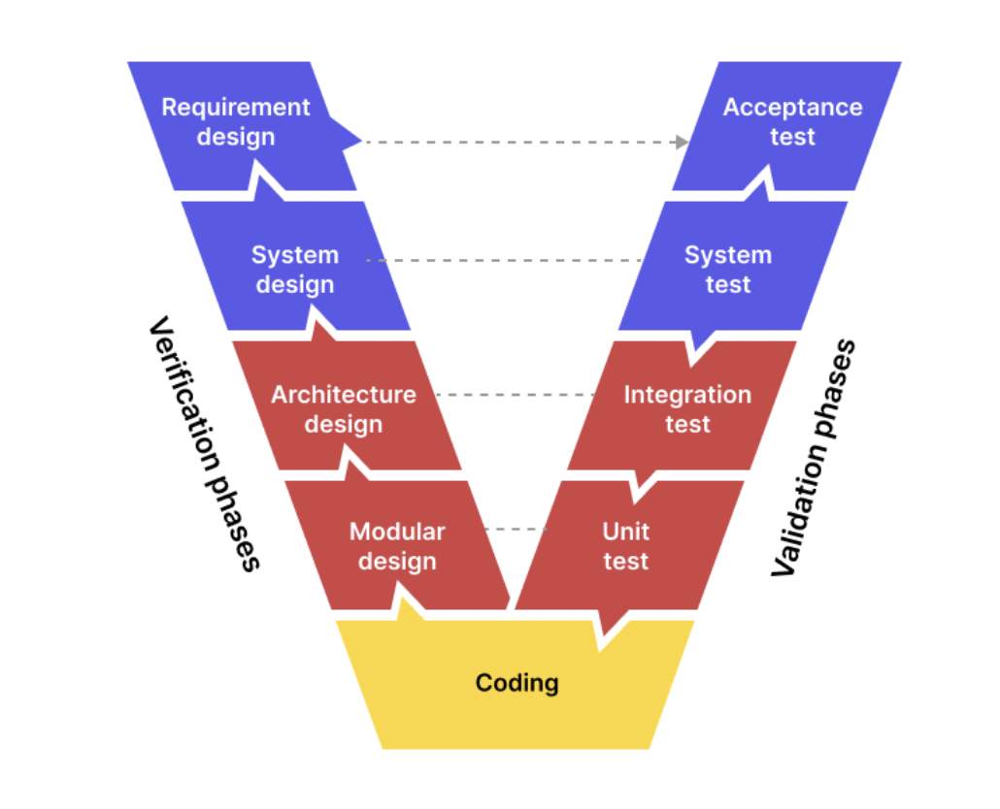
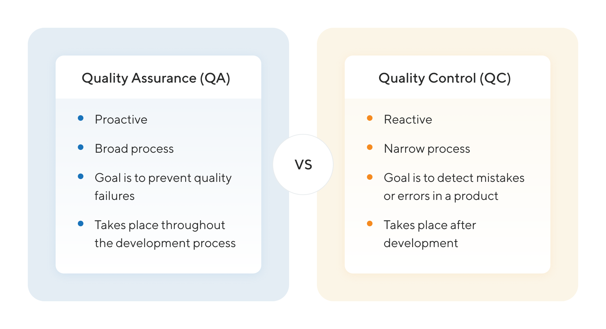
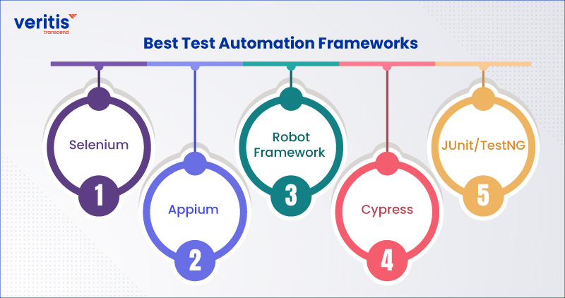
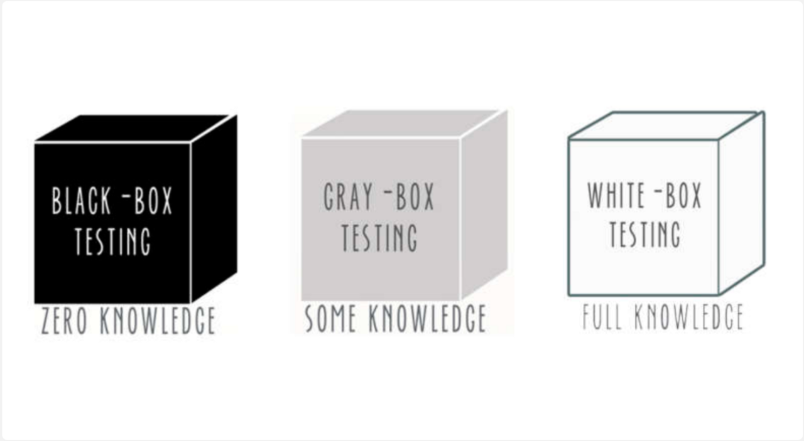
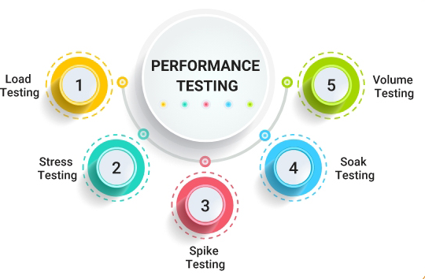
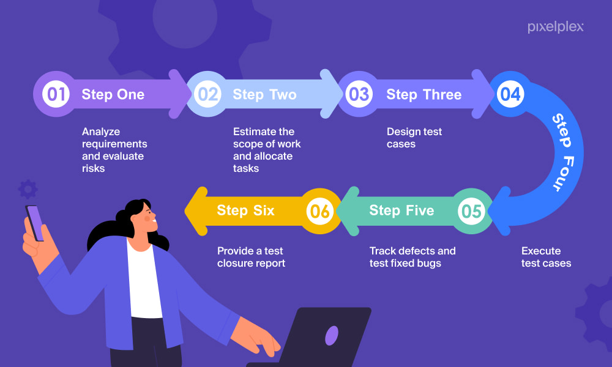
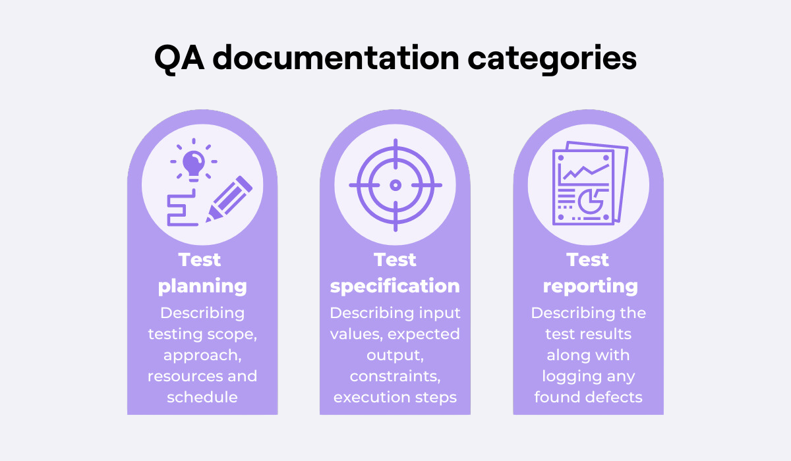
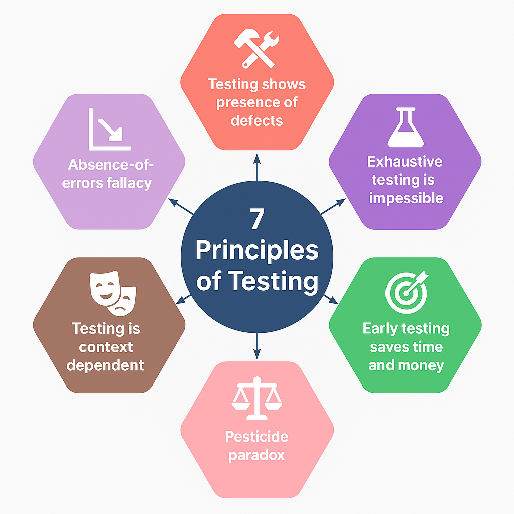
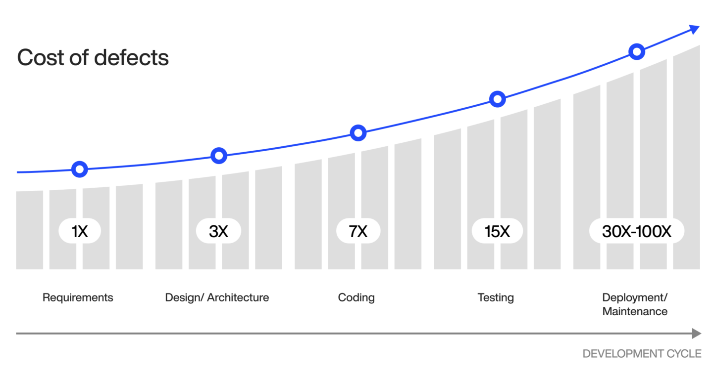

# Briefing Document: Software Testing Overview and Key Concepts

## Introduction

This document provides an overview of software testing, focusing on key concepts, methodologies, and types of testing used to ensure software quality.

## Core Concepts of Software Testing

Software testing verifies that a product meets customer requirements and is free from defects. It involves validating the software's behavior against expected outputs and fixing issues before launch.

 

 

### Quality Assurance (QA) vs Quality Control (QC)

- **QA**: Focuses on continuous improvement of the development process.
- **QC**: Verifies product compliance with QA standards, focusing on detecting bugs.

   
  
   

## Types of Software Testing

### By Execution

- **Manual Testing**: Testing done manually without tools.
- **Automated Testing**: Uses scripts and tools to execute tests.

   
  
   

### By Access/Knowledge of the System

- **Black Box Testing**: Tests based on inputs and outputs without knowledge of the system.
- **White Box Testing**: Involves knowledge of internal code for testing.
- **Gray Box Testing**: A mix of black and white box testing.

   
  
   

### By Scope

- **Unit Testing**: Tests individual components.
- **Integration Testing**: Tests interactions between integrated units.
- **System Testing**: Tests the entire system.
- **Acceptance Testing**: Verifies suitability based on business needs.

### Other Testing Types

   
  
   

- **Performance Testing**: Measures speed, responsiveness, and stability.
- **Load Testing**: Tests system performance under expected load.
- **Spike Testing**: involves rapidly increasing the load on the system by a large amount in a short period of time.
- **Soak testing**: applying a moderate load to the system for an extended period of time.
- **Stress Testing**: Evaluates system behavior under extreme conditions.
- **Usability Testing**: Evaluates user experience.
- **Security Testing**: Identifies vulnerabilities and security risks.

## The Testing Process

   
  
   

1. **Analysis of Requirements**: Reviewing project requirements.
2. **Planning**: Defining scope and testing strategy.
3. **Test Case Development**: Creating detailed actions for testing.
4. **Test Execution**: Running tests and capturing results.
5. **Verification**: Retesting after fixes.
6. **Documentation and Reporting**: Creating test reports.

## Essential Documentation

   
  
   

- **Requirement Traceability Matrix (RTM)**: Links requirements to test cases.
- **Test Plan**: Describes testing approach, schedule, and resources.
- **Test Cases**: Step-by-step instructions for testing.
- **Test Reporting**: Summarizes testing activities and results.

## Software Testing Principles

Several key principles ensure that testing is effective and reliable.

   
  
   

## Software Testing Estimation

Estimation involves calculating the resources, time, and cost needed for testing.

   
  
   

## Software Testing Standards

- **ISO/IEC/IEEE 29119**: International standards for testing processes and documentation.

## Key Roles

- **Software Testers**: Evaluate software for defects.
- **SDET (Software Development Engineer in Test)**: Combines testing and development skills to automate tests.

## Conclusion

Software testing is essential for delivering high-quality software. It requires careful planning, documentation, and the use of appropriate testing methodologies to meet business needs and user expectations.
