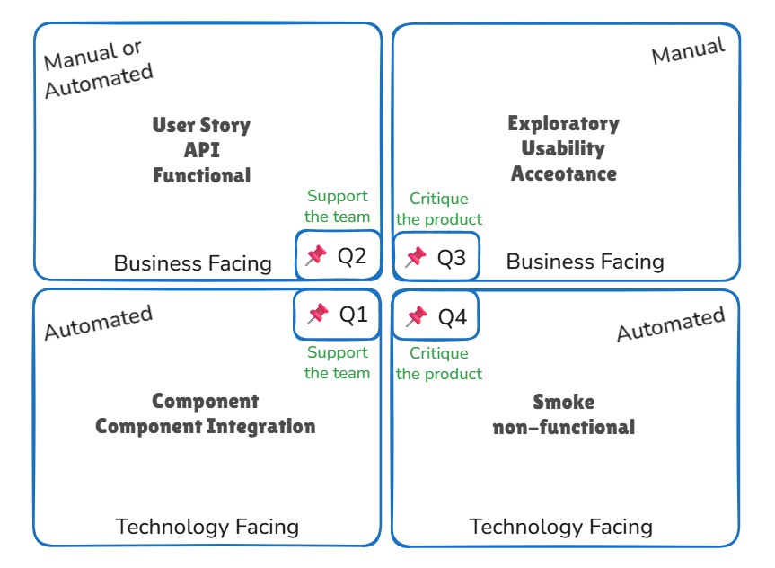

# Testing Quadrants (5.1.7)

The Testing Quadrants, defined by Brian Marick (Marick 2003, Crispin 2008), help group test levels with appropriate test types, activities, techniques, and work products in Agile software development. This model supports test management by visualizing and ensuring all relevant test types and levels are included in the SDLC. It also helps differentiate and describe test types to all stakeholders, including developers, testers, and business representatives.

## Overview

- Tests can be **business facing** or **technology facing**.
- Tests can **support the team** (guide development) or **critique the product** (measure behavior against expectations).
- The combination of these viewpoints forms four quadrants:

---
 

    

 

## Quadrant Q1: Technology Facing, Support the Team
- **Purpose:** Guide development with a focus on technology.
- **Examples:**
  - Component tests
  - Component integration tests
- **Characteristics:**
  - Should be automated
  - Included in the CI process

---

## Quadrant Q2: Business Facing, Support the Team
- **Purpose:** Guide development with a focus on business needs.
- **Examples:**
  - Functional tests
  - User story tests
  - User experience prototypes
  - API testing
  - Simulations
- **Characteristics:**
  - Check acceptance criteria
  - Can be manual or automated

---

## Quadrant Q3: Business Facing, Critique the Product
- **Purpose:** Critique the product from a business perspective.
- **Examples:**
  - Exploratory testing
  - Usability testing
  - User acceptance testing
- **Characteristics:**
  - User-oriented
  - Often manual

---

## Quadrant Q4: Technology Facing, Critique the Product
- **Purpose:** Critique the product from a technology perspective.
- **Examples:**
  - Smoke tests
  - Non-functional tests (except usability)
- **Characteristics:**
  - Often automated

---

## Summary Table

| Quadrant | Facing         | Purpose           | Examples                                   |
|----------|---------------|-------------------|--------------------------------------------|
| Q1       | Technology    | Support the team  | Component tests, integration tests          |
| Q2       | Business      | Support the team  | Functional tests, user stories, API tests   |
| Q3       | Business      | Critique product  | Exploratory, usability, acceptance testing  |
| Q4       | Technology    | Critique product  | Smoke, non-functional (performance, etc.)   |

---

**Tip:** Use the quadrants to ensure your Agile testing strategy covers all necessary perspectives and test types throughout the SDLC.
