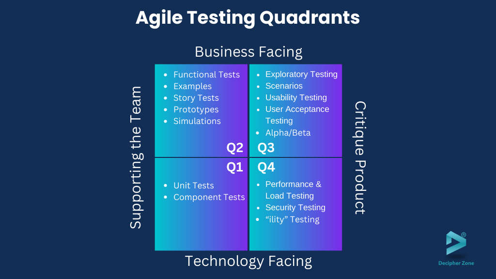

# Testing Quadrants Model

The Testing Quadrants model, introduced by Brian Marick, is a widely recognized framework in software testing that categorizes testing activities based on their purpose and the development lifecycle stage. It helps Quality Assurance (QA) teams, developers, and stakeholders align testing efforts with business goals and technical requirements. The model is particularly popular in Agile and DevOps environments, where iterative development and continuous feedback are key.

 

 

image from: https://www.decipherzone.com/

---

## Structure of the Model

The model is organized into four quadrants along two axes:

- **X-axis**: Distinguishes between tests that **support the team** (e.g., aiding development) and tests that **critique the product** (e.g., evaluating the final deliverable).
- **Y-axis**: Differentiates between **technology-facing tests** (focused on code and technical implementation) and **business-facing tests** (focused on user needs and business value).

### The Four Quadrants

1. **Quadrant Q1: Technology-facing tests that support the team**

   - **Focus**: Unit tests, component tests, API tests, and integration tests.
   - **Purpose**: Ensure the code's technical integrity and functionality at a low level. These tests are written and executed by developers to catch defects early.
   - **Examples**:
     - Testing a `calculateTotal()` function in a shopping cart module.
     - Verifying that two modules (e.g., payment and inventory) integrate correctly using a mock service.
   - **Tools**: JUnit, pytest, Postman for API testing.

2. **Quadrant Q2: Business-facing tests that support the team**

   - **Focus**: Acceptance tests, functional tests, and scenario-based tests derived from user stories or requirements.
   - **Purpose**: Validate that the system meets business needs and supports the development process by providing quick feedback.
   - **Examples**:
     - Testing a user story: "Given a registered user, when they log in with valid credentials, then they see their dashboard."
     - Verifying that a search feature returns relevant results for a given keyword.
   - **Tools**: Cucumber, Selenium, SpecFlow.

3. **Quadrant Q3: Business-facing tests that critique the product**

   - **Focus**: Exploratory testing, usability testing, user acceptance testing (UAT), and alpha/beta testing.
   - **Purpose**: Assess the product from an end-user perspective, identifying usability issues, edge cases, or unmet expectations beyond documented requirements.
   - **Examples**:
     - Observing how easily a new user navigates the checkout process.
     - Testing the app on different devices to ensure a consistent user experience.
   - **Tools**: Manual testing, TestRail for tracking, usability labs.

4. **Quadrant Q4: Technology-facing tests that critique the product**
   - **Focus**: Performance testing, security testing, scalability testing, and reliability testing.
   - **Purpose**: Evaluate non-functional aspects of the system to ensure it performs well under load, is secure, and scales appropriately.
   - **Examples**:
     - Load testing an e-commerce site with 10,000 concurrent users.
     - Conducting a penetration test to identify security vulnerabilities.
   - **Tools**: JMeter, LoadRunner, OWASP ZAP, Gatling.

## Detailed Examples

| Quadrant | Test Type        | Example Scenario                      | Expected Outcome                               |
| -------- | ---------------- | ------------------------------------- | ---------------------------------------------- |
| Q1       | Unit Test        | Test `addItem(item)` in a cart class  | Returns true if item added, false if duplicate |
| Q2       | Acceptance Test  | User adds item and checks cart total  | Total updates correctly                        |
| Q3       | Usability Test   | User tries to find "shoes" via search | Search results are intuitive and relevant      |
| Q4       | Performance Test | Simulate 5,000 users adding items     | System handles load without crashing           |

## When to Use the Testing Quadrants Model

The model is versatile and can be applied in various situations by QA teams:

- **Agile Development**: Use Q1 and Q2 during sprints to support rapid development and validate features iteratively. Q3 and Q4 can be employed before release for user validation and performance checks.
- **Continuous Integration/Continuous Deployment (CI/CD)**: Integrate Q1 (unit tests) and Q2 (acceptance tests) into the pipeline for automated feedback. Use Q4 for pre-deployment performance and security checks.
- **Legacy System Upgrades**: Apply Q3 to ensure the updated system meets current user needs, and Q4 to verify performance under new loads.
- **New Product Launches**: Use all quadrants—Q1 for code stability, Q2 for feature validation, Q3 for user acceptance, and Q4 for scalability and security.
- **Regulatory Compliance**: Leverage Q4 for security and Q2 for ensuring business rules (e.g., GDPR compliance) are met.

## Benefits for QA

- **Comprehensive Coverage**: Ensures testing spans technical, functional, and non-functional aspects.
- **Team Collaboration**: Encourages developers (Q1), business analysts (Q2), and testers (Q3, Q4) to work together.
- **Risk Mitigation**: Identifies issues early (Q1, Q2) and post-development (Q3, Q4).
- **Adaptability**: Can be tailored to project size, complexity, or timeline.

## Challenges and Considerations

- **Resource Intensive**: Q3 and Q4 may require specialized skills or tools (e.g., performance engineers).
- **Balancing Priorities**: Teams must decide how much effort to allocate to each quadrant based on project goals.
- **Dependency Management**: Q1 and Q2 tests need to be stable before Q3 and Q4 can effectively critique the product.

## Implementation Tips for QA

- **Automate Q1 and Q2**: Use CI tools like Jenkins to run unit and acceptance tests continuously.
- **Plan Q3 Sessions**: Schedule exploratory testing with real users or stakeholders.
- **Schedule Q4 Regularly**: Conduct performance and security tests in pre-production environments.
- **Track Metrics**: Measure coverage (e.g., 80% unit test coverage for Q1) and report findings to stakeholders.

## Conclusion

The Testing Quadrants model is a strategic tool for QA to ensure a balanced approach to testing. By categorizing activities into Q1-Q4, teams can align technical excellence with business value, delivering high-quality software that meets user expectations and performs reliably.
