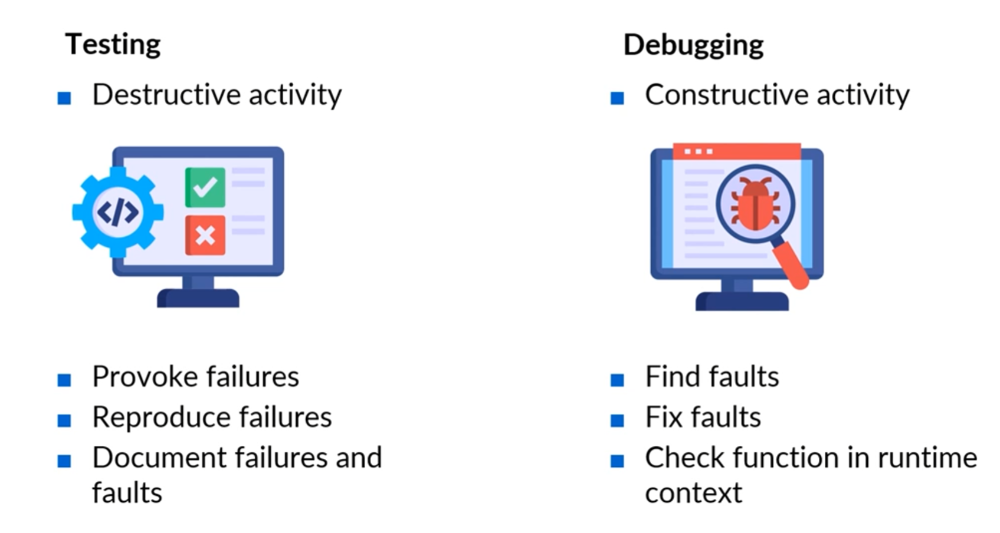

# What is Testing?

## Before the definition we need to define some concepts:

- Humans make errors in the software development
- Humans are bad to accept and identify their own mistakes
- Humans are good about point the errors from other humans

This can lead us to the necessity of a QA role to test the Software during the SDLC. But also:

- Testing can detect Failures, finding defects
- Testing can never be complete
- We test softwares to gain confidence about the quality
- To provide information to decision-making

**The cost of testing must be lower than the cost to fix the defects**

## Software Quality - P E R F U M

 

 

## Purpose of Testing - Verification x Validation

 

 

## Testing Levels

- **UNIT TESTING**: individual components
- **INTEGRATION TESTING**: how components work together
- **SYSTEM TESTING**: entire system as a whole
- **ACCEPTANCE TESTING**: system meets user requirements

## Testing Types

### Functional

 

 

### Non-Functional

 

 

## Testing Advantages

 

 
Source: https://www.techment.com/explore-techments-state-of-the-art-software-testing-process/

## Testing Processes

 

 
Source: https://www.techment.com/explore-techments-state-of-the-art-software-testing-process/

### Test Planning and Control
- Defining test objectives, scope, and resources.

### Test Analysis and Design
- Developing test cases based on requirements.

### Test Implementation and Execution
- Executing test cases and recording results.

### Evaluating Exit Criteria and Reporting
- Assessing if the software meets defined criteria and reporting test results.

### Test Closure Activities
- Finalizing test cases and scripts, ensuring deliverables match requirements, and documenting the testing process.

## Testing x Debugging
### Understanding Testing and Debugging
- Testing is a process aimed at identifying defects in software to validate its behavior against requirements.
- Debugging involves finding, analyzing, and removing defects after failures have been triggered during testing.

 

 

### Key Differences Between Testing and Debugging
Testing is a destructive activity that provokes failures to document issues, while debugging is constructive, focusing on fixing faults.

**Developers and testers approach their tasks differently; testing should be conducted separately from development.**

